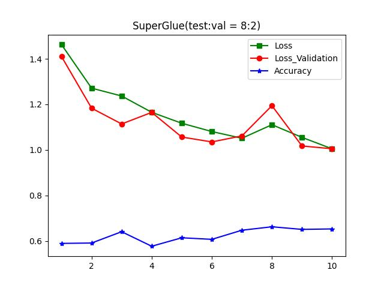
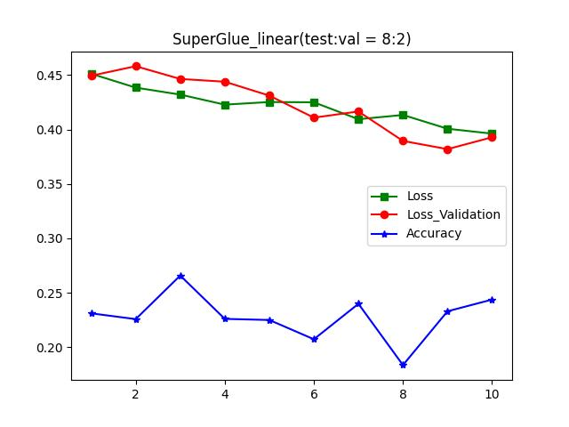
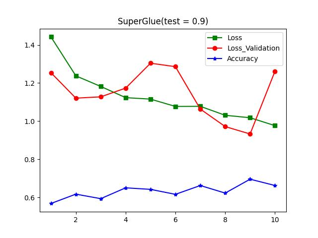
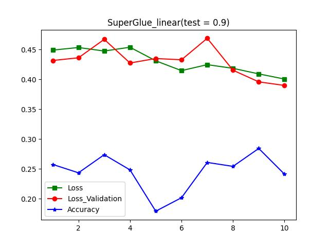

# Superglue_linear
In this experiment, I build a model which is based on superglue model. I changed the sinkhorn algorithm part of the superglue to the linear programming. The replacement works, since the optimal transport problem is basically a linear assignment problem. Therefore, we can solve it by other linear programming which I used as linear_sum_assignment from scipy.optimzie. The other difficult stuff is to figuring out a way to reflect the loss_mean for my new model. In this model, I choose to reflect it based on the cosine similarity which provided by origin model. I set it as when the match is correct, the loss is (1 - cosine similarity), and when the match is incorrect, the loss is cosine similarity. I think this can work since it can decrease the cosine similarity of incorrect matches. 

In my code, the train.py is the document that can train and evaluate the SuperGlue model, and train_linear.py is the document that can train and evaluate my model. In this experiment, I’m focusing on improve my model’s performance by setting a good way to get the loss and reduce it. However, it is not that successful. 

I use shrec_16 as my dataset in this experiment, I write a blender.py to transfer the 3D model to a pair of image. Then I use sift to detect the key points and figure out which are matched. Then I separate it into test and train which are contained in data file. In the training process, I separate the test dataset into test and validation dataset by the input rate. I can use ‘—test_rate’  to set how many percentage the test dates want to occupy. The default value is 0.8. Then I use these two dataset as input to train and valuate SuperGlue model and my model which I called it SuperGlue_linear. Here is three figures of two model, accuracy, loss, and loss_val. 

I can clearly see that the loss, loss_val are both decreasing when the epoch increasing. However the accuracy of my model is not increasing significantly. I think this probably because the way I set the loss can’t significantly influence the accuracy.(??)

And I don’t see any significant change when I change the test_rate, which shows below. Maybe the difference is the validation loss is not that stable.

I think if I can let the pair match and improve the loss function. The performance of my model can improve a lot. 

